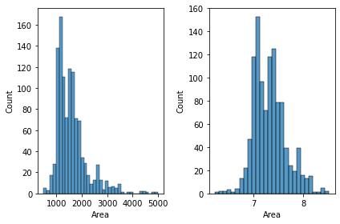
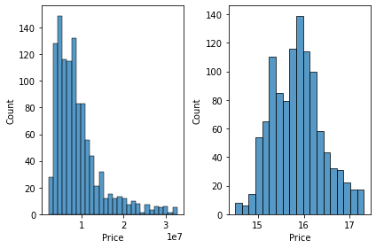

# Predicting-Housing-Prices-in-hyderabad-India

The challenge in this project was to use only linear/polynomial regression models in addition to trying all possible cleaning, scaling, feature engineering, polynomial degrees, and regularization techniques that lead to the highest score.

The dataset used in this project is obtained from [Kaggle - Housing Prices in Metropolitan Areas of India](https://www.kaggle.com/ruchi798/housing-prices-in-metropolitan-areas-of-india)\
The dataset includes:
- Collection of prices of new and resale houses located in the metropolitan areas of India.
- The amenities provided for each house.

**In this project I worked only on 'Hyderabad.csv'.** 

## Methodology
At first:
- 20% of the data were splitted for final testing.
- Checking for Nulls and non were found.
- Checking for duplicated rows, 384 were found and dropped.

### EDA
* Count plot for all amenities features shows that some rows have values of 9 in all cells which doesn't make sense and also mentioned in dataset's kaggle page that '9' was used to mark values were nothing was mentioned about certain amenities.\
--> So, we can safely drop these records from the data.
* Box plot shows that that there is some outliers in prices.
* Histogram of continous features (Price & Area) shows that they have some outliers and also are right skewed.

### Feature engineering
1. Using geopy library to extract the coordinates of each location --> longitude & latitude features.
2. Instead of having 35 amenities features, combine them in one feature called 'Luxury' which represent the degree of ameninties that each house have indoor and outdoor:
    * If ALL the luxury features are absent --> assign 0
    * If ANY of the indoor luxury features are available --> assign 1
    * If ANY of the outdoor luxury features are available --> assign 2
    * If ALL of the indoor & outdoor luxury features are available --> assign 3
Finally, drop all amenities columns and keep 'Luxury' column only.
--> For code simplicity, feature_eng() function is created to implement feature engineering steps and to be applied directly on the training and testing sets.

### Preprocessing
1. Removing outliers from 'Price' above and below 3.5IQR and from 'Area' by thresholding (keep values <= 6000).

2. I tried dropping 'Location' feature after extracting longitude & latitude as a substitute for it, but, keeping it increases model performance.\
In the task, CatBoostEncoder() gave the highest performance out of all encoding techniques.

    **Note:** CatBoostEncoder() is a target-based categorical encoder but also involves an ordering principle in order to overcome this problem of target leakage.

3. Apply log transform to 'Area' for scaling and overcoming the sckewness.

4. Apply log transform to 'Price' for scaling, overcoming the sckewness and most importantly to avoid negative values in prediction.\
(to obtain actual predicted prices, apply np.expm1() on the predicted values)

- We can see how the log transformation perfectly overcame the sckewness in both features.

5. Apply StandardScaler() on "Location","Latitude", and "Longitude" features.

### Model Training
As mentioned above, only linear/polynomial regression models can be used in this task, hence, I applied both using cross validation and with different degrees of polynomial features, also with Lasso and Ridge regulariation.\
This table summarize results obtained:

|        Model   	    |  Training with CV	|  Testing	|
|----------------------	|------------------	|----------	|
|Linear Regression   	|RMSE= 0.2339, r2-score= 0.819|RMSE= 0.2115, r2-score= 0.878|
|Polynomial (degree=2)  |RMSE= 0.2253, r2-score= 0.832|RMSE= 0.2081, r2-score= 0.882|
|Lasso (poly deg=4)  	|RMSE= 0.2234, r2-score= 0.835|RMSE= 0.2191, r2-score= 0.869|
|Ridge (poly deg=4)    	|RMSE= 0.2336, r2-score= 0.8199|RMSE= 0.2216, r2-score= 0.866|
